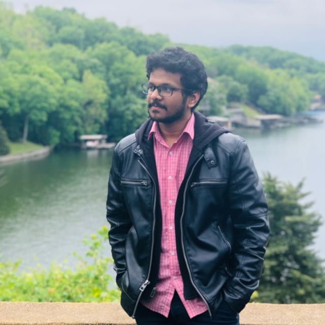
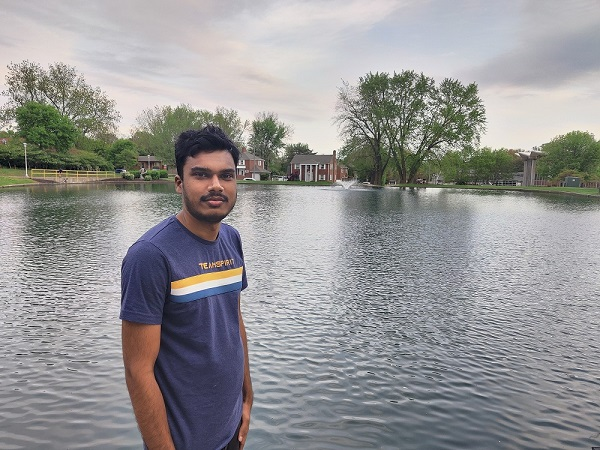

# Team Amigos
* ## Table of contents
  * Our Project
  * Our Team
  * Project Charter
  * Scope
  * Schedule
  * Budget

## Our Project
* #### Project Name: Amigos Gaming Connect.    Tag Line: Tired of SoloQ find a Squad here
* This is a platform where people can find In game names and Ids of different players. It is an user friendly application.
* You can find people who play similar games, try and connect with them to team-up.
* It gonna be easy peasy lemon squeezy to form a squad and push your tire or rank anything.

## Our Team
## Product Owner: [Gunda Sai Naga Anu Teja](https://github.com/GUNDAANUTEJ)  
   
 ---
 
 ## Scrum Master: [Ganapuram Sai Kumar](https://github.com/SaiKumar249)  
   
 ---
 
 ## Developer: [Chaganti Sumant](https://github.com/sumant52)  
   
 
---
## Project Charter [Project Charter link](https://github.com/GUNDAANUTEJ/pm-s03-g05-project/blob/main/markdown/CHARTER.md) 

----

## Scope
### Work Breakdown Structure
### 1. Initiating
* 1.1 Requirement gathering
*	1.2 List out main functionalities
* 1.3 List out additional functionalities
*	1.4 List out key features
*	1.5 Architecture 
*	1.6 Meetings
### 2.Planning
* 2.1 Budget planning
*	2.2 Choosing the technologies
*	2.3 Estimating the resources
*	2.4 Plan the project schedule
*	2.5 Set goals
*	2.6 Define the mvp
*	2.7 Plan sprints
*	2.8 Divide the functionalities and features into user stories
### 3. Execution
* 3.1 Set up a meeting with the human resources and explain the scope of the project
*	3.2 Start development
*	3.3 Unit Testing
*	3.4 Sprint meetings
*	3.5 Drops
### 4. Monitering and Controlling
*	4.1 Integration Testing
*	4.2 Scrum of scrums
*	4.3 Quality Analyste testing
*	4.4 Bug fixes
### 5. Closing
* 5.1 Deployment
*	5.2 Performance Testing
*	5.3 Regression Testing

## Schedule
* Start Date : 05/31/2021
* End Date :   09/06/2021
* Duration : 14 weeks

## Budget
* Total budget is 70,000$ on an overall project.

* [Budget](https://github.com/GUNDAANUTEJ/pm-s03-g05-project/blob/main/budget/budget.xlsx) 
* 

